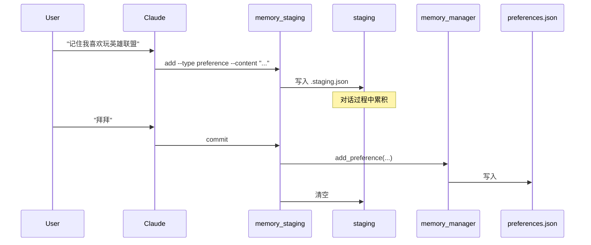
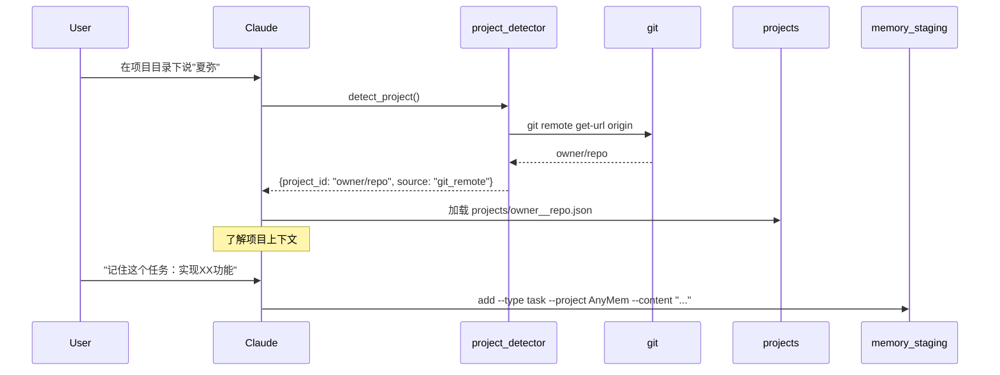

# Claude Memory 项目完整架构文档

> 事无巨细的项目说明，涵盖每个文件的功能、关键函数、文件关系、触发场景和完整工作流程。

---

## 目录

1. [项目概览](#1-项目概览)
2. [目录结构](#2-目录结构)
3. [核心文件详解](#3-核心文件详解)
   - [入口文件](#31-入口文件)
   - [Python 脚本](#32-python-脚本)
   - [参考文档](#33-参考文档)
   - [模板文件](#34-模板文件)
4. [数据存储结构](#4-数据存储结构)
5. [完整工作流程](#5-完整工作流程)
6. [文件依赖关系图](#6-文件依赖关系图)
7. [触发条件速查表](#7-触发条件速查表)

---

## 1. 项目概览

### 1.1 项目定位

Claude Memory（remembering-anything）是一个 **Claude Code Agent Skill**，为 AI 对话提供**持久化记忆能力**。

### 1.2 核心特性

| 特性 | 说明 |
|------|------|
| 三层记忆架构 | 结构化记忆（JSON）+ 原始笔记（Markdown）+ 智能总结 |
| 零配置安装 | 首次运行自动初始化目录结构 |
| 自动激活 | 每次对话自动加载记忆（通过 CLAUDE.md 配置） |
| 项目隔离 | 每个项目独立记忆，自动检测 |
| 暂存区机制 | 对话中临时存储，结束时统一提交 |
| 5 分钟缓存 | 快速启动，避免重复加载 |
| 渐进披露 | SKILL.md 精简，详细内容在 references/ |

### 1.3 两个目录的区别

```
~/.claude/skills/
├── claude-memory/                 # 开发环境（Git 项目）
│   └── remembering-anything/      # 开发代码
│       └── user-data/             # 测试数据（不上传）
│
└── remembering-anything/          # 运行环境（用户安装）
    └── user-data/                 # 真实用户数据
```

**关键点**：开发环境的脚本会自动指向运行环境的 `user-data/`，实现"开发时测真实数据"。

---

## 2. 目录结构

```
remembering-anything/
├── SKILL.md                      # [核心] Skill 定义文件（167 行，精简版）
├── references/                   # [核心] 详细参考文档（渐进披露）
│   ├── memory-operations.md      # 记忆分类、暂存区详解
│   └── special-scenarios.md      # 特殊场景处理
├── scripts/                      # [核心] Python 脚本
│   ├── activate.py               # 激活入口（必要）
│   ├── quick_load.py             # 缓存生成（必要）
│   ├── memory_staging.py         # 暂存区（必要）
│   ├── memory_manager.py         # 记忆管理核心（必要）
│   ├── memory_schema.py          # 数据结构定义（必要）
│   ├── path_config.py            # 路径配置（必要）
│   ├── project_detector.py       # 项目检测（必要）
│   ├── setup_directories.py      # 目录初始化（必要）
│   ├── memory_cli.py             # 命令行工具（可选）
│   ├── smart_reminder.py         # 智能提醒（可选）
│   ├── backup_manager.py         # 备份管理（可选）
│   ├── memory_visualizer.py      # 可视化（可选）
│   └── summary_engine.py         # 总结引擎（可选）
├── assets/                       # 模板文件
│   ├── user-persona-template.md
│   ├── ai-persona-template.md
│   └── core-template.json
├── user-data/                    # [数据] 用户数据（.gitignore）
│   ├── memory/                   # 结构化记忆
│   ├── notes/                    # 原始笔记
│   ├── config/                   # 配置文件
│   ├── summaries/                # 智能总结
│   ├── media/                    # 媒体文件
│   ├── outputs/                  # 输出文件
│   └── backups/                  # 备份文件
└── docs/                         # 文档
    └── PROJECT_ARCHITECTURE.md   # 本文档
```

**注**：根目录散落的 .md 文件（api-reference.md、WORKFLOWS.md 等）待整理到 docs/ 目录。

---

## 3. 核心文件详解

### 3.1 入口文件

#### SKILL.md

**位置**：`remembering-anything/SKILL.md`

**功能**：Skill 定义文件，Claude Code 读取此文件来了解如何使用这个 Skill。

**关键内容**（符合最佳实践）：

```yaml
---
name: remembering-anything           # 功能导向命名（非人名）
description: 长期记忆系统，在对话开始时加载用户画像、项目上下文和历史记忆以实现个性化对话...
when_to_use: 当需要个性化对话、记住用户背景、了解项目历史或保持跨会话上下文连贯性时使用。
allowed-tools: Bash(python {baseDir}/scripts/*:*), Read, Grep, Write
---
```

**核心指令**：

1. **第一步**：执行 `python {baseDir}/scripts/activate.py`，然后读取缓存
2. **第二步**：理解缓存数据（user、pets、team、recent、preferences、special_dates、project_memory）
3. **第三步**：自然使用记忆回复用户（不要说"根据记忆显示"）

**人设位置**：人设（夏弥）已移至 `~/.claude/CLAUDE.md`，SKILL.md 专注于任务导向。

**触发场景**：
- 通过 `~/.claude/CLAUDE.md` 配置，每次新对话自动激活

---

### 3.2 Python 脚本

#### activate.py

**位置**：`scripts/activate.py`

**功能**：统一激活入口，一步完成所有初始化。

**关键函数**：

| 函数 | 功能 | 返回值 |
|------|------|--------|
| `is_cache_fresh()` | 检查缓存是否在 5 分钟内 | bool |
| `has_staging_data()` | 检查暂存区是否有数据 | bool |
| `auto_commit_staging()` | 自动提交暂存区 | bool（是否提交了数据） |
| `main()` | 主函数 | 无 |

**执行流程**：

```
1. 检查暂存区 → 有数据则自动提交
2. 检查缓存新鲜度 → 5 分钟内直接返回
3. 调用 quick_load.py 生成缓存
```

**调用时机**：
- SKILL.md 激活时执行
- 对话开始时

**依赖**：
- `memory_staging.py`（暂存区操作）
- `quick_load.py`（缓存生成）

---

#### quick_load.py

**位置**：`scripts/quick_load.py`

**功能**：快速加载记忆，生成缓存文件。

**关键函数**：

| 函数 | 功能 | 返回值 |
|------|------|--------|
| `load_json_file(path)` | 安全加载 JSON | dict/list |
| `load_global_memory()` | 加载全局记忆 | `{facts, preferences, experiences}` |
| `load_project_memory(id)` | 加载项目记忆 | dict 或 None |
| `load_recent()` | 加载最近活动 | list（最近 3 条） |
| `extract_core_info(mem)` | 提取核心信息 | `{user, pets, team, preferences}` |
| `check_special_dates_today(core)` | 检查今日特殊日期 | list |
| `format_project_summary(mem)` | 格式化项目记忆 | dict |
| `main()` | 主函数 | 无（写入缓存文件） |

**输出文件**：`user-data/memory/.quick_load_cache.json`

**缓存结构**：

```json
{
  "project": {"id": "owner/repo", "source": "git_remote", "has_memory": true},
  "special_dates": [],
  "recent": "最近活动内容",
  "recent_date": "2025-11-24",
  "recent_status": "completed",
  "user": {"birthday": "2000-11-01", "location": "北京市"},
  "pets": [{"name": "意外", "type": "cat", ...}],
  "team": {"formed": "2023-10-01", "members": [...]},
  "preferences": {"gaming": [...], "development": [...]},
  "project_memory": {...}  // 当前项目的完整记忆
}
```

**依赖**：
- `project_detector.py`（检测项目）

---

#### memory_staging.py

**位置**：`scripts/memory_staging.py`

**功能**：记忆暂存区，对话中临时存储，结束时统一提交。

**命令行用法**：

```bash
# 添加全局记忆
python memory_staging.py add --type fact --content "住在北京"
python memory_staging.py add --type preference --content "喜欢玩英雄联盟"
python memory_staging.py add --type experience --content "最近在学 Python"

# 添加项目记忆
python memory_staging.py add --type task --project AnyMem --content "实现XX"
python memory_staging.py add --type completed --project AnyMem --content "完成XX"
python memory_staging.py add --type decision --project AnyMem --content "用React"
python memory_staging.py add --type pitfall --project AnyMem --content "dayjs时区"

# 查看/提交
python memory_staging.py list
python memory_staging.py commit
python memory_staging.py clear
python memory_staging.py count
```

**关键函数**：

| 函数 | 功能 | 返回值 |
|------|------|--------|
| `load_staging()` | 加载暂存区 | list |
| `save_staging(items)` | 保存暂存区 | 无 |
| `add_to_staging(...)` | 添加到暂存区 | dict（条目） |
| `list_staging()` | 列出所有条目 | list |
| `clear_staging()` | 清空暂存区 | 无 |
| `_commit_project_item(item)` | 提交单个项目记忆 | 无 |
| `commit_staging()` | 提交所有记忆 | dict（统计结果） |

**记忆类型**：

| 类型 | 全局/项目 | 存储位置 |
|------|-----------|----------|
| `fact` | 全局 | `memory/facts.json` |
| `preference` | 全局 | `memory/preferences.json` |
| `experience` | 全局 | `memory/experiences.json` |
| `task` | 项目 | `memory/projects/{项目}.json` |
| `completed` | 项目 | 同上 |
| `decision` | 项目 | 同上 |
| `pitfall` | 项目 | 同上 |

**触发场景**：
- 用户说"记住 XX"
- 对话结束时自动提交

**依赖**：
- `memory_manager.py`（全局记忆提交）

---

#### memory_manager.py

**位置**：`scripts/memory_manager.py`

**功能**：记忆管理核心类，提供增删改查和冲突检测。

**类**：`MemoryManager`

**初始化**：

```python
mm = MemoryManager()  # 使用默认路径
mm = MemoryManager(memory_dir="/custom/path")  # 自定义路径
```

**添加记忆方法**：

| 方法 | 功能 | 关键参数 |
|------|------|----------|
| `add_fact(...)` | 添加事实 | content, category, source, importance, supersedes |
| `add_preference(...)` | 添加偏好 | content, category, source, strength |
| `add_experience(...)` | 添加经历 | content, category, source, date, outcome |

**查询方法**：

| 方法 | 功能 | 返回值 |
|------|------|--------|
| `get_memory(id, type)` | 获取单条记忆 | dict 或 None |
| `get_active_facts(category)` | 获取活跃事实 | list |
| `get_active_preferences(category)` | 获取活跃偏好 | list |
| `get_active_experiences(category)` | 获取活跃经历 | list |
| `search_memories(query, type)` | 搜索记忆 | list |
| `get_core_memories()` | 获取核心记忆 | dict |
| `get_memories_by_importance(level)` | 按重要性获取 | dict |
| `query_by_context(tags, limit)` | 按上下文查询 | list |

**更新/删除方法**：

| 方法 | 功能 |
|------|------|
| `update_fact(id, **updates)` | 更新事实 |
| `deprecate_memory(id, type)` | 标记废弃 |
| `delete_memory(id, type)` | 永久删除 |
| `mark_accessed(id, type)` | 标记访问 |

**冲突检测**：

```python
conflicts = mm.detect_conflicts()
# 检测同一类别下的矛盾信息（如多个 location）
```

**重要性级别**：

| 级别 | 说明 | 加载时机 |
|------|------|----------|
| `core` | 核心信息 | 激活时加载（<50ms） |
| `active` | 活跃记忆 | 激活时加载（<100ms） |
| `contextual` | 上下文记忆 | 按需加载 |
| `archived` | 归档记忆 | 显式查询时加载 |

**依赖**：
- `memory_schema.py`（数据结构）

---

#### memory_schema.py

**位置**：`scripts/memory_schema.py`

**功能**：定义记忆数据结构（TypedDict）。

**类型定义**：

```python
class BaseMemory(TypedDict):
    id: str                    # 唯一 ID（mem_xxx）
    type: Literal["fact", "preference", "experience"]
    content: str               # 记忆内容
    source: str                # 来源
    timestamp: str             # 创建时间（ISO）
    last_updated: str          # 更新时间（ISO）
    confidence: float          # 置信度（0.0-1.0）
    status: Literal["active", "deprecated", "conflicted"]
    tags: List[str]            # 标签
    importance: Literal["core", "active", "contextual", "archived"]
    context_tags: List[str]    # 触发标签
    access_count: int          # 访问次数
    last_accessed: Optional[str]
    expires_at: Optional[str]  # 过期时间（短期记忆）
    is_work_in_progress: bool

class FactMemory(BaseMemory):
    category: str              # 类别（location, pet, account...）
    supersedes: Optional[str]  # 替代的旧记忆 ID

class PreferenceMemory(BaseMemory):
    category: str
    strength: Literal["strong", "moderate", "weak"]

class ExperienceMemory(BaseMemory):
    category: str
    date: Optional[str]
    outcome: Optional[str]

class ConflictReport(TypedDict):
    conflict_id: str
    memory_ids: List[str]
    conflict_type: Literal["contradiction", "update", "refinement"]
    description: str
    suggested_resolution: str
    confidence: float
```

**辅助函数**：

| 函数 | 功能 |
|------|------|
| `create_memory_id()` | 生成唯一 ID（mem_xxx） |
| `get_current_timestamp()` | 获取当前 ISO 时间 |
| `validate_memory(memory)` | 验证记忆格式 |

---

#### path_config.py

**位置**：`scripts/path_config.py`

**功能**：统一路径管理，自动检测开发/运行环境。

**关键函数**：

| 函数 | 功能 |
|------|------|
| `get_user_data_dir()` | 获取 user-data 目录 |
| `get_memory_dir()` | 获取 memory 目录 |
| `get_notes_dir()` | 获取 notes 目录 |
| `get_config_dir()` | 获取 config 目录 |
| `get_summaries_dir()` | 获取 summaries 目录 |
| `get_media_dir()` | 获取 media 目录 |
| `get_outputs_dir()` | 获取 outputs 目录 |
| `get_backups_dir()` | 获取 backups 目录 |

**环境检测逻辑**：

```python
# 开发环境：~/.claude/skills/claude-memory/remembering-anything/scripts/
# 运行环境：~/.claude/skills/remembering-anything/scripts/

parent_dir = skill_dir.parent
is_dev_env = parent_dir.name == "claude-memory"

if is_dev_env:
    # 指向运行环境的 user-data
    return skills_dir / "remembering-anything" / "user-data"
else:
    # 使用相对路径
    return skill_dir / "user-data"
```

---

#### project_detector.py

**位置**：`scripts/project_detector.py`

**功能**：自动检测当前项目 ID。

**检测优先级**：

1. **CLAUDE.md** - 读取 `project_id: xxx` 字段
2. **Git Remote** - 解析 `git remote get-url origin`
3. **目录名** - 使用当前目录名作为 fallback

**关键函数**：

| 函数 | 功能 | 返回值 |
|------|------|--------|
| `detect_from_claude_md()` | 从 CLAUDE.md 读取 | str 或 None |
| `detect_from_git_remote()` | 从 git remote 解析 | str 或 None |
| `detect_from_directory()` | 使用目录名 | str |
| `detect_project()` | 主检测函数 | `{project_id, source, cwd}` |
| `get_project_memory_dir(id)` | 获取项目记忆目录 | Path |
| `ensure_project_memory_structure(id)` | 确保目录结构 | Path |

**支持的 Git URL 格式**：

- `https://github.com/owner/repo.git` → `owner/repo`
- `git@github.com:owner/repo.git` → `owner/repo`

---

#### setup_directories.py

**位置**：`scripts/setup_directories.py`

**功能**：初始化 Skill 目录结构。

**创建的目录**：

```
user-data/
├── notes/
│   ├── daily/
│   └── topics/
├── config/
├── memory/
├── summaries/
│   ├── monthly/
│   └── topics/
└── media/
    └── images/
```

**复制的模板**：

- `assets/user-persona-template.md` → `user-data/config/user-persona.md`
- `assets/ai-persona-template.md` → `user-data/config/ai-persona.md`

**调用时机**：
- 首次安装时
- 手动执行 `python setup_directories.py`

---

#### memory_cli.py

**位置**：`scripts/memory_cli.py`

**功能**：命令行管理工具。

**命令**：

```bash
python memory_cli.py stats          # 显示统计
python memory_cli.py search "关键词"  # 搜索记忆
python memory_cli.py conflicts      # 检测冲突
python memory_cli.py unprocessed    # 未处理笔记
python memory_cli.py export backup.json  # 导出
python memory_cli.py list --type fact  # 列出记忆
```

**依赖**：
- `memory_manager.py`
- `summary_engine.py`

---

#### smart_reminder.py

**位置**：`scripts/smart_reminder.py`

**功能**：智能提醒系统，生成个性化提醒。

**类**：`SmartReminder`

**提醒类型**：

| 方法 | 功能 | 触发概率 |
|------|------|----------|
| `get_daily_reminders()` | 获取今日提醒 | 主入口 |
| `_get_cat_reminder()` | 宠物相关提醒 | 里程碑日/20% |
| `_get_work_reminders()` | 项目进度提醒 | 有未更新项目时 |
| `_get_milestone_reminders()` | 纪念日提醒 | 月度纪念日 |
| `_get_memory_callback()` | 随机回忆 | 30% |
| `_get_time_based_reminder()` | 时段提醒 | 20-40% |
| `get_context_reminder(ctx)` | 上下文提醒 | 关键词匹配 |

**提醒历史**：存储在 `memory/reminder_history.json`，保留 30 天。

---

#### backup_manager.py

**位置**：`scripts/backup_manager.py`

**功能**：备份和导出管理。

**类**：`BackupManager`

**方法**：

| 方法 | 功能 | 输出 |
|------|------|------|
| `create_full_backup(desc)` | 完整备份（ZIP） | `backups/backup_full_xxx.zip` |
| `create_memory_export('json')` | JSON 导出 | `backups/memories_export_xxx.json` |
| `create_memory_export('markdown')` | Markdown 导出 | `backups/memories_export_xxx.md` |
| `list_backups()` | 列出所有备份 | list |
| `restore_backup(path)` | 恢复备份 | bool |
| `auto_backup()` | 自动每日备份 | Path 或 None |

---

#### memory_visualizer.py

**位置**：`scripts/memory_visualizer.py`

**功能**：生成 HTML 可视化报告。

**类**：`MemoryVisualizer`

**生成内容**：

- 记忆统计仪表盘
- 时间线视图
- 特别记忆（意外）
- 标签云

**输出**：`user-data/outputs/html/basic/memory_visualization_xxx.html`

---

#### summary_engine.py

**位置**：`scripts/summary_engine.py`

**功能**：总结引擎框架，管理笔记处理。

**类**：`SummaryEngine`

**方法**：

| 方法 | 功能 |
|------|------|
| `get_instruction_prompt()` | 获取提取指令 |
| `list_notes(pattern)` | 列出笔记 |
| `list_unprocessed_notes()` | 列出未处理笔记 |
| `mark_note_processed(path)` | 标记已处理 |
| `save_summary(content, type)` | 保存总结 |

**处理日志**：`memory/processing_log.json`

---

### 3.3 参考文档（references/）

SKILL.md 采用渐进披露模式，详细内容在 `references/` 目录：

#### memory-operations.md

**位置**：`references/memory-operations.md`

**内容**：
- 记忆分类详解（fact/preference/experience/task/completed/decision/pitfall）
- 暂存区机制（add/list/commit/clear）
- 查询记忆优先级
- 常见错误示例

**何时读取**：用户需要添加记忆或查询记忆时。

---

#### special-scenarios.md

**位置**：`references/special-scenarios.md`

**内容**：
- 首次见面处理
- 特殊日期（生日、纪念日）
- 项目记忆使用
- 记忆冲突处理
- 防止幻觉指南

**何时读取**：遇到特殊场景时按需加载。

---

### 3.4 模板文件

| 文件 | 位置 | 功能 |
|------|------|------|
| `user-persona-template.md` | assets/ | 用户画像模板 |
| `ai-persona-template.md` | assets/ | AI 画像模板 |
| `project-claude-template.md` | assets/ | 项目 CLAUDE.md 模板 |

---

## 4. 数据存储结构

### 4.1 memory/ 目录

```
memory/
├── .quick_load_cache.json      # 快速加载缓存（5分钟刷新）
├── .staging.json               # 暂存区（对话中临时存储）
├── facts.json                  # 事实记忆
├── preferences.json            # 偏好记忆
├── experiences.json            # 经历记忆
├── recent.json                 # 最近活动
├── metadata.json               # 元数据
├── reminder_history.json       # 提醒历史
├── reminder_log.json           # 提醒日志
├── processing_log.json         # 笔记处理日志
└── projects/                   # 项目记忆
    └── AnyMem.json             # 每个项目一个文件
```

### 4.2 记忆文件格式

**facts.json / preferences.json / experiences.json**：

```json
{
  "mem_xxx123": {
    "id": "mem_xxx123",
    "type": "fact",
    "category": "personal",
    "content": "住在北京市",
    "source": "conversation",
    "timestamp": "2025-11-17T19:07:45.916929",
    "last_updated": "2025-11-17T19:07:45.916929",
    "confidence": 1.0,
    "status": "active",
    "tags": ["personal", "location"],
    "importance": "core",
    "context_tags": [],
    "access_count": 0,
    "last_accessed": null,
    "metadata": {
      "birthday": "2000-11-01",
      "location": "北京市"
    }
  }
}
```

**projects/xxx.json**：

```json
{
  "name": "AnyMem",
  "description": "备忘录应用",
  "tech_stack": ["React", "TypeScript"],
  "current_focus": "AI标签功能",
  "last_active": "2025-11-26",
  "tasks": [
    {"title": "负面反馈机制", "priority": "medium", "status": "pending"}
  ],
  "completed": [
    {"title": "提示词优化", "date": "2025-11-26"}
  ],
  "decisions": [],
  "pitfalls": []
}
```

### 4.3 notes/ 目录

```
notes/
├── daily/                      # 每日笔记
│   ├── 2025-11-19_项目开发记录.md
│   └── 2025-11-24-project-refactor-plan.md
├── topics/                     # 主题笔记
│   ├── agent-skills-guide.md
│   └── agent-skills-best-practices.md
├── projects/                   # 项目笔记
└── imported/                   # 导入的笔记
```

### 4.4 config/ 目录

```
config/
├── user-persona.md             # 用户画像
└── ai-persona.md               # AI 画像
```

---

## 5. 完整工作流程

### 5.1 激活流程

```mermaid
sequenceDiagram
    User->>Claude: 说"夏弥"或开始对话
    Claude->>SKILL.md: 读取 Skill 定义
    SKILL.md->>activate.py: python scripts/activate.py
    activate.py->>staging: 检查暂存区
    alt 暂存区有数据
        activate.py->>memory_staging: auto_commit_staging()
    end
    activate.py->>cache: 检查缓存新鲜度
    alt 缓存过期（>5分钟）
        activate.py->>quick_load.py: 生成缓存
        quick_load.py->>project_detector: 检测项目
        quick_load.py->>memory: 加载全局记忆
        quick_load.py->>projects: 加载项目记忆
        quick_load.py->>cache: 写入 .quick_load_cache.json
    end
    Claude->>cache: 读取缓存
    Claude->>User: 按人设回复
```

### 5.2 记忆添加流程



### 5.3 项目记忆流程



### 5.4 查询记忆流程

```
用户："我之前说过喜欢什么游戏吗？"

1. 先查缓存 → .quick_load_cache.json（已加载）
   → preferences.gaming: ["喜欢玩英雄联盟"]

2. 如果缓存没有，查完整记忆 → preferences.json

3. 如果结构化记忆没有，搜笔记 → Grep("游戏", notes/)

4. 找不到 → "这个我不太记得，能详细说说吗？"
```

---

## 6. 文件依赖关系图

```
~/.claude/CLAUDE.md（人设 + 激活规则）
    │
    ▼
SKILL.md（任务导向）
    │
    ├─► references/memory-operations.md（按需加载）
    └─► references/special-scenarios.md（按需加载）
    │
    ▼
activate.py ────────────────────────┐
    │                               │
    ├─► memory_staging.py           │
    │       │                       │
    │       └─► memory_manager.py ◄─┘
    │               │
    │               └─► memory_schema.py
    │
    └─► quick_load.py
            │
            └─► project_detector.py
                    │
                    └─► path_config.py

可选脚本依赖：
- memory_cli.py ──► memory_manager.py, summary_engine.py
- smart_reminder.py ──► memory 文件（直接读取）
- backup_manager.py ──► memory 文件（直接读取）
- memory_visualizer.py ──► path_config.py, memory 文件
- summary_engine.py ──► path_config.py
```

---

## 7. 触发条件速查表

| 功能 | 触发条件 | 相关文件/脚本 |
|------|----------|---------------|
| 激活记忆系统 | 每次新对话（CLAUDE.md 配置） | activate.py |
| 添加全局记忆 | 说"记住 XX" | memory_staging.py |
| 添加项目记忆 | 说"这个任务/坑/决策" + 在项目目录下 | memory_staging.py |
| 提交暂存区 | 说"拜拜"或对话结束 | memory_staging.py commit |
| 查询记忆 | 说"我之前说过 XX 吗" | 查缓存 → 查记忆 → 搜笔记 |
| 记忆分类详解 | 添加记忆时 | references/memory-operations.md |
| 特殊场景处理 | 首次见面/生日/项目记忆 | references/special-scenarios.md |
| 生成缓存 | 缓存过期（>5分钟） | quick_load.py |
| 生成可视化 | 手动执行 | memory_visualizer.py（可选）|
| 备份记忆 | 手动执行 | backup_manager.py（可选）|
| 智能提醒 | 特殊日期/里程碑 | smart_reminder.py（可选）|

---

## 附录：快速命令参考

```bash
# 激活（通常由 SKILL.md 自动执行）
python scripts/activate.py

# 暂存区操作
python scripts/memory_staging.py add --type fact --content "内容"
python scripts/memory_staging.py add --type task --project AnyMem --content "实现XX"
python scripts/memory_staging.py list
python scripts/memory_staging.py commit

# 记忆管理（可选）
python scripts/memory_cli.py stats
python scripts/memory_cli.py search "关键词"
python scripts/memory_cli.py list --type fact

# 备份（可选）
python scripts/backup_manager.py

# 可视化（可选）
python scripts/memory_visualizer.py
```

---

*文档版本：2.0 | 更新日期：2025-11-26*

## 变更日志

### v2.0 (2025-11-26)

**架构改进**：
- SKILL.md 精简到 167 行（原 225 行），符合最佳实践
- 新增 `references/` 目录实现渐进披露
- 人设移至 `~/.claude/CLAUDE.md`
- frontmatter 改为第三人称描述，添加 `when_to_use` 字段

**删除的脚本**：
- `rename_assistant.py`（改名功能已简化，直接编辑 CLAUDE.md）
- `toggle_autoload.py`（CLAUDE.md 结构已变，不再需要模式切换）

**新增文件**：
- `references/memory-operations.md`（记忆分类详解）
- `references/special-scenarios.md`（特殊场景处理）
